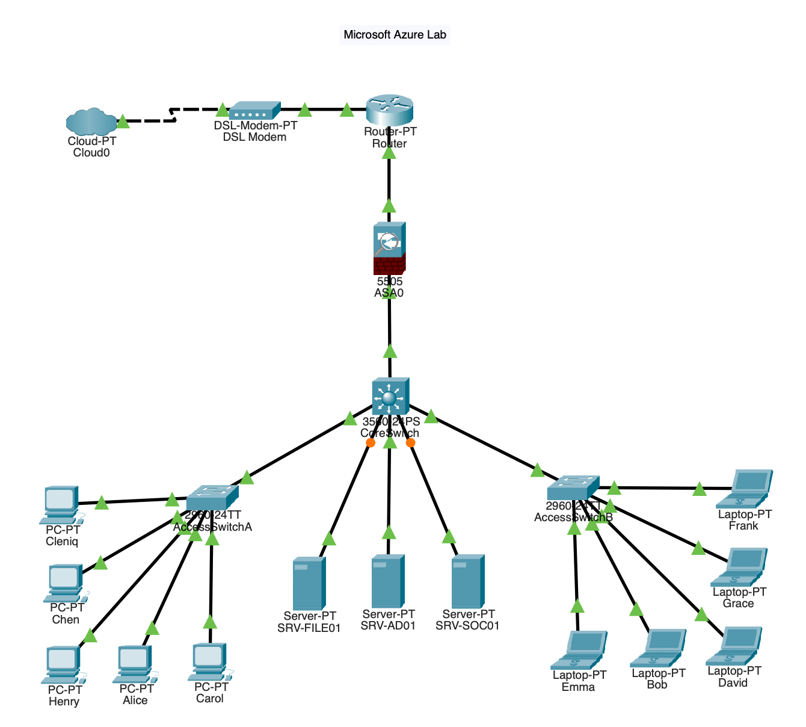
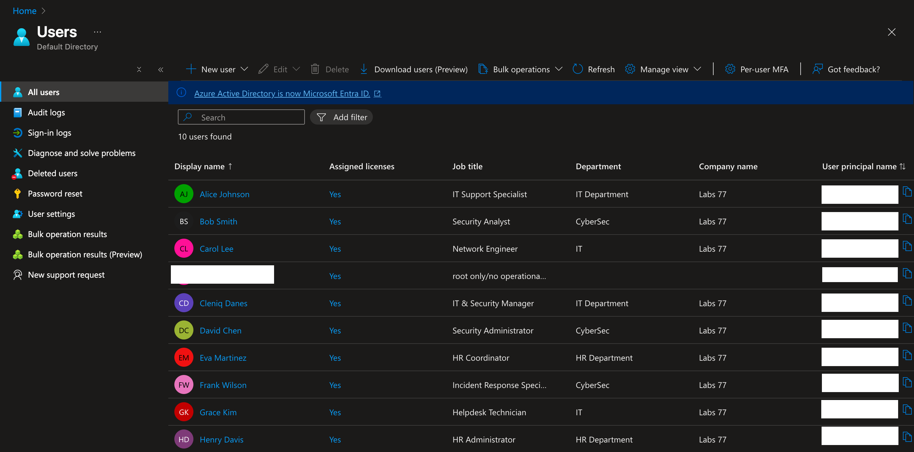
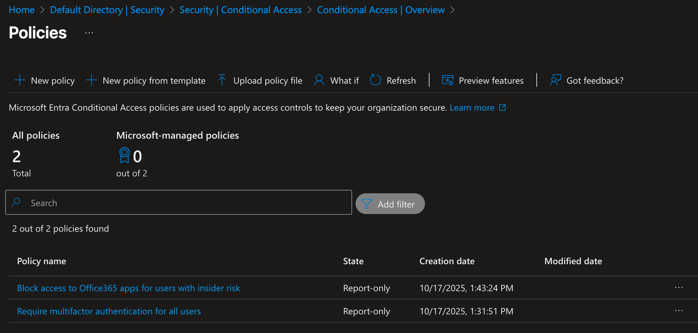
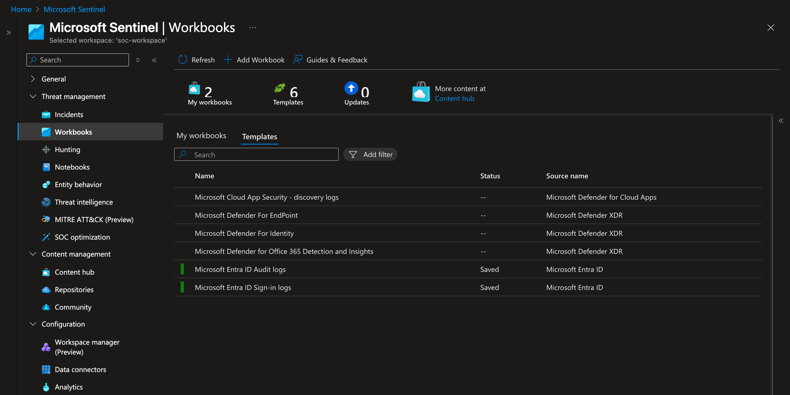
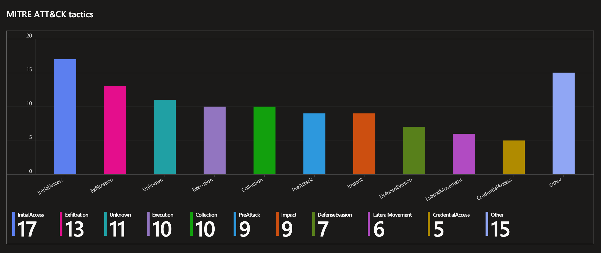
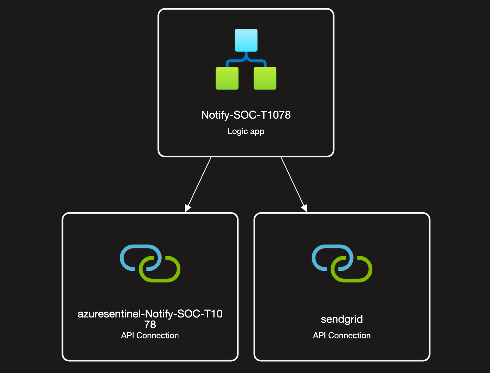

# Azure SOC Lab

## Overview
This lab simulates a Security Operations Center (SOC) environment using Microsoft Azure.
The goal was to demonstrate detection, investigation, and automation capabilities using:

- Microsoft Sentinel  
- Microsoft Defender for Cloud  
- Entra ID (Conditional Access + Identity Management)  
- Playbooks (Logic Apps)  
- Cisco Packet Tracer for network topology design  

---

## Network Topology
I designed a virtual network in Cisco Packet Tracer to represent various endpoints and segments connected to Azure resources. Logs from these simulated devices were collected in Microsoft Sentinel for monitoring.

---

## Azure Users and Role Assignments
Within Entra ID (Azure AD), I created multiple users to simulate real SOC roles:
- **SOC Analyst** – read-only access to Sentinel incidents  
- **SOC Engineer** – configuration and playbook management  
- **Admin** – Azure management and Conditional Access configuration  

This setup allowed me to assign permissions based on least privilege and observe how user identity plays a key role in security posture.

---

## Conditional Access Policies
Conditional Access was configured in Entra ID to enforce layered authentication and access control.

Key policies:
- Require MFA for all users  
- Block app access to M365 users with insiders risk 

This provided the foundation for identity-driven protection and adaptive access control across Azure resources.

---

## Microsoft Sentinel & Defender for Cloud Configuration
Microsoft Sentinel was the core SIEM in the lab. I connected data sources from Azure Activity, Defender for Cloud, and simulated endpoints to create a unified monitoring dashboard.

### Analytic Rules
| Alert | Description | Response |
|--------|--------------|----------|
| Suspicious RDP Login | Detected RDP access from unfamiliar IP | Logic App sends Teams alert |
| Privilege Escalation | Role change event in Azure | Email alert + ticket creation |

---

## Playbooks and Automation
Playbooks were created in Logic Apps to automate SOC workflows. For example:
- Automatically notify analysts when Sentinel generates a high-severity alert  
- Send Teams messages or emails with incident details  
- Trigger follow-up actions like disabling compromised accounts
  
 

---

## Lessons Learned
- How Sentinel integrates with Defender for Cloud and Entra ID  
- Practical use of Conditional Access for adaptive protection  
- Automating responses using Logic Apps  
- Importance of user roles and permissions in detection workflows  

---

## Future Improvements
- Add M365 Defender integration  
- Expand topology with simulated on-prem logs  
- Integrate threat intelligence feeds  

---
