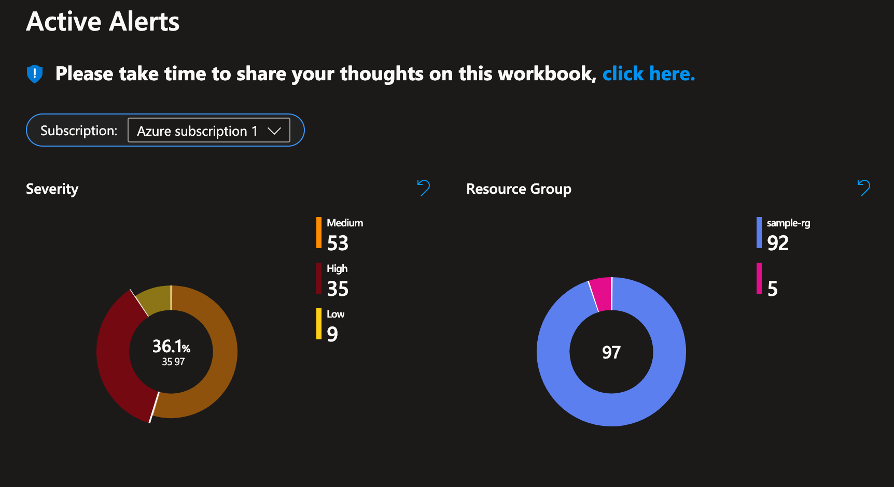

# Azure Identity & Security Monitoring Lab

## Overview
This lab demonstrates core Azure security and monitoring principles using Microsoft cloud tools. The goal was to develop foundational skills in identity protection, security configuration, and cloud monitoring—key competencies for cloud administrators and security-minded system administrators.

The environment includes:

- Microsoft Sentinel – SIEM/SOAR foundation
- Microsoft Defender for Cloud – posture management + threat detection
- Microsoft Entra ID – identity security and Conditional Access
- Logic Apps – automation/playbook workflows
- Cisco Packet Tracer – simulated on-prem topology

*This project reflects real-world scenarios where cloud admins must secure identities, monitor cloud resources, and respond to basic alerts.*

---

## Network Topology

A network diagram was built in Cisco Packet Tracer to model:

- Segmented internal networks
- Endpoints and management hosts
- Connections to Azure cloud services

*Although Packet Tracer devices do not feed logs directly to Sentinel, the topology served as the conceptual design for cloud-to-hybrid monitoring.*

---

## Identity and Access Management (Entra ID)
To simulate role-based access in an enterprise:

- SOC Analyst – read-only access to Sentinel incidents  
- SOC Engineer – configuration and playbook management  
- Administrator – Azure management and Conditional Access configuration  

*This setup allowed me to assign permissions based on least privilege and observe how user identity plays a key role in security posture.*

---

## Conditional Access Policies
Two core Conditional Access policies were created:

1. Require MFA for All Users
- Enforces multi-factor authentication
- Reduces credential-based risk
2. Block Access for Users with Insider Risk
- Demonstrates adaptive access
- Simulates a scenario where risky accounts are automatically restricted

*These policies form a basic identity-driven Zero Trust foundation.*

---

## Microsoft Sentinel Configuration

Sentinel was configured with:

- Azure Activity logs
- Defender for Cloud alerts
- Sign-in logs
- Audit logs

Built Workbooks:

- Overview dashboard for identity events
- Workbook showing MITRE ATT&CK® mapping

### Defender for Cloud
Defender for Cloud provided:

- Secure Score overview
- Recommendations for hardening Azure resources
- Integrated alerts sent to Sentinel

*This portion of the lab demonstrates cloud posture management fundamentals.*

---

### Analytic Rules
| Alert | Description | Response |
|--------|--------------|----------|
| Suspicious RDP Login | Sign-in from unusual location/IP | Logic App → Teams Alert |
| Privilege Escalation | Unexpected role assignment | Email alert + ticket simulation |

---

## Playbooks (Logic App)
Automated workflows were developed to notify analysts and simulate SOAR activity.

Examples:

- High-severity alert → Teams message
- Azure AD privilege escalation → Email to admin
- Simulated actions such as disabling a user or posting to a webhook
  
 

---

## Lessons Learned
- How identity, Conditional Access, and RBAC shape cloud security
- How logs flow from Azure services into Sentinel
- Basics of alert creation, investigation, and automation
- Importance of least-privilege access for operational security

---

## Future Improvements
1. Build a Full Joiner–Mover–Leaver (JML) Workflow

- Create a documented and semi-automated lifecycle process using Entra ID:
- Automated account creation & license assignment
- Role change workflows based on group membership
- Secure deprovisioning (disable → archive → revoke)

2. Implement Intune Device Management

- Deploy Intune to manage Windows/macOS devices:
- Compliance policies (encryption, OS version, password rules)
- App deployment
- 
Autopilot provisioning

Why it matters: Modern endpoint management is a core SysAdmin skill. 

---
